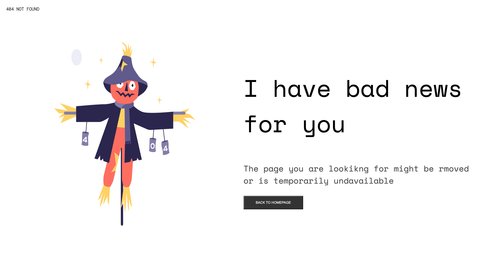

<!-- Please update value in the {}  -->

<h1 align="center">404-Not-Found</h1>

   Solution for a challenge from  <a href="http://devchallenges.io" target="_blank">Devchallenges.io</a>.

  <h3>
    <a href="https://rzounlom.github.io/404-not-found/">
      Demo
    </a>
     | 
    <a href="https://github.com/rzounlom/404-not-found">
      Solution
    </a>
     | 
    <a href="https://devchallenges.io/challenges/wBunSb7FPrIepJZAg0sY">
      Challenge
    </a>
  </h3>

<!-- TABLE OF CONTENTS -->

## Table of Contents

- [Overview](#overview)
- [Contact](#contact)

<!-- OVERVIEW -->

## Overview

- devChallenges.io 404-not-found challenge
- It was nice to take a step back and get back to the fundamentals of HTML and CSS
- I learned that it's always good to practice the fundamentals
- Thoughts: take your time and just keep building things!

This application/site was created as a submission to a [DevChallenges](https://devchallenges.io/challenges) challenge. The [challenge](https://devchallenges.io/challenges/wBunSb7FPrIepJZAg0sY) was to build an application to complete the given user stories.

- [Steps to replicate a design with only HTML and CSS](https://devchallenges-blogs.web.app/how-to-replicate-design/)
- [Node.js](https://nodejs.org/)
- [Marked - a markdown parser](https://github.com/chjj/marked)

## Contact

- GitHub [rzounlom](https://github.com/rzounlom)
